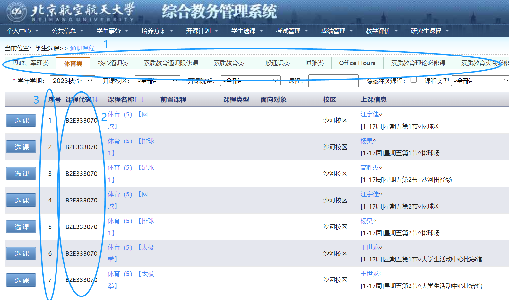

# BUAA Course Enrollment Automation

## 简介

**`buaa_course_enrollment.py`** 是一个专为北京航空航天大学（BUAA）设计的自动选课脚本。其主要功能是帮助学生在开放选课期间自动选择课程，减轻手动选课的负担和压力。脚本使用Python编写，结合了BeautifulSoup和requests库来实现自动登录和选课功能。

### 主要功能

- 自动登录北京航空航天大学的教务系统。
- 根据用户输入的课程类型和课程代码自动选择课程。
- 能够自动识别当前的学期，并根据学期修改相关参数。
- 在成功选课前持续尝试选课，提高选课成功率。

## 使用方式

### 安装必要的库

首先，确保你已经安装了Python和所需要的库：

```bash
pip install -r requirements
```

### 配置脚本

1. 打开`buaa_course_enrollment.py`文件。
2. 修改脚本顶部的配置部分，填入你的账号、密码、课程类型、课程代码和对应序号。

```python
USERNAME = '你的账号'
PASSWORD = '你的密码'
COURSE_TYPE = '你要选择的课程类型'
COURSE_CODE = '你要选择的课程代码'
SERIAL_CODE= '你要选择的课程序号'
```

对应下图，1、2、3分别为COURSE_TYPE（可以在代码`TYPE_DICT`中找到）、COURSE_CODE和SERIAL_CODE（从001开始）。例如，我希望选择该图中高胜杰老师的足球课，我将填写：

```python
COURSE_TYPE = '体育'
COURSE_CODE = 'B2E333070'
SERIAL_CODE= '003'
```



### 运行脚本

在脚本所在的目录打开终端或命令提示符，然后运行以下命令：

```bash
python buaa_course_enrollment.py
```

脚本将自动登录并开始尝试选课。成功选课后，它将退出。

## 注意事项

- 请确保在使用脚本之前已知晓并遵守北京航空航天大学的相关规定和政策。
- 脚本仅用于教育和学习目的，请勿用于任何非法或不道德的用途。

## 贡献

如果你有任何改进或功能增加的建议，请通过Pull Request或Issue来贡献。

## 许可

该项目根据[GNU GENERAL PUBLIC LICENSE许可证](LICENSE)进行许可。

## 特别感谢

本项目参考了[Cauchy1412](https://github.com/Cauchy1412)的[BUAAGetCourse](https://github.com/Cauchy1412/BUAAGetCourse)。

